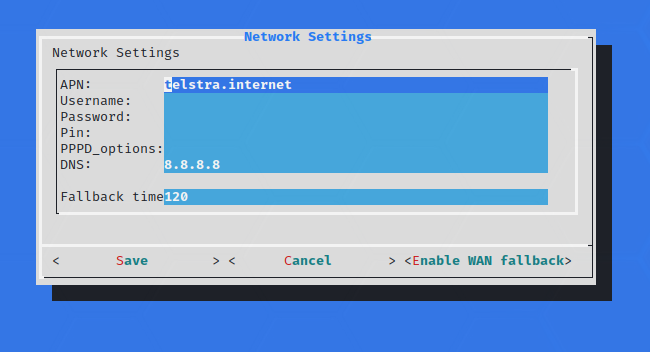

# Plain 3G Dongle Config

## Steps
1. Connect to the turtle's SSH server
1. Setup the sim card APN
2. Remove configuration for host tethering
3. Configure FW3 for 3G tethering
4. Profit

## Connect to the turtle's SSH server
* Connect to ssh on the turtle (`root:sh3llz@172.16.84.1`) and you will be launched into the "turtle shell"
** If you have disabled the turtle shell, use the command `turtle`

## Setup the sim card APN
3G services usually have a service identifier (citation needed) or APN which needs to be configured to successfully make a connection

* Enter the "Config" --> "Configure 3G Modem" menu
* Set the APN from your cellular provider



* Save and exit the turtle shell.

## Remove configuration for host tethering
The default configuration expects the usb host to provide a gateway which could affect routing
For further details see [https://openwrt.org/docs/guide-user/base-system/basic-networking]

* Edit the `/etc/config/network` configuration file
** `nano /etc/config/network`
* Remove the `option gateway '172.16.84.84'` line from the config, you can use ctrl+k in nano to do this easier
```
config interface 'lan'
        option ifname 'eth0'
        option proto 'static'
        option ipaddr '172.16.84.1'
        option gateway '172.16.84.84'
        option netmask '255.255.255.0'
        option ip6assign '60'
        option metric '30'
```
* ctrl+o to save, ctrl+x to exit

## NOTE THIS WAS DONE BEFORE REMOVING THE GATEWAY AND MAY NOT BE REQUIRED
## Configure FW3 for 3G Tethering
Note: Some of these changes may not be strictly necessary.
The OpenWRT platform that the Lan Turtle is based on uses the FW3 firewall by default. This generates a rather complicated iptables config from a few config files. 
It is generally easier to edit the base config rather than messing with the iptables config directly.
For further details see [https://openwrt.org/docs/guide-user/firewall/overview]

* Edit the `\etc\config\firewall` config file for FW3
* Add a name to the standard lan --> wan forwarding section
** Replace `config forwarding` with `config forwarding 'wan_forwarding_lan_out'`
* Add a forwarding section from the lan --> 3gwan
** After the `config forwarding 'wan_forwarding_lan_out'` section, add the following:
```
config forwarding '3gwan_forwarding_lan_out'
        option src 'lan'
        option dest '3gwan'
```

The following shows the top section of my config after the changes have been made

```root@turtle:~# cat /etc/config/firewall
config defaults
        option syn_flood        1
        option input            REJECT
        option output           REJECT
        option forward          REJECT
# Uncomment this line to disable ipv6 rules
#       option disable_ipv6     1

config zone
        option name             lan
        list   network          'lan'
        option input            ACCEPT
        option output           ACCEPT
        option forward          ACCEPT

config zone
        option name             wan
        list   network          'wan'
        list   network          'wan6'
        option input            REJECT
        option output           ACCEPT
        option forward          ACCEPT
        option masq             1
        option mtu_fix          1

config zone
        option name             3gwan
        list   network          '3gwan'
        option input            REJECT
        option output           ACCEPT
        option forward          REJECT
        option masq             1
        option mtu_fix          1

config forwarding 'wan_forwarding_lan_out'
        option src              lan
        option dest             wan

config forwarding '3gwan_forwarding_lan_out'
        option src 'lan'
        option dest '3gwan'

config zone 'vpn'
        option name 'vpn'
        option network 'vpn'
        option input 'ACCEPT'
        option forward 'REJECT'
        option output 'ACCEPT'
        option masq '1'

config forwarding 'vpn_forwarding_lan_in'
        option src 'vpn'
        option dest 'lan'

config forwarding 'vpn_forwarding_lan_out'
        option src 'lan'
        option dest 'vpn'
```

## Profit
The Lan Turtle should now provide a NAT'ed connection out the 3G Wan interface.

